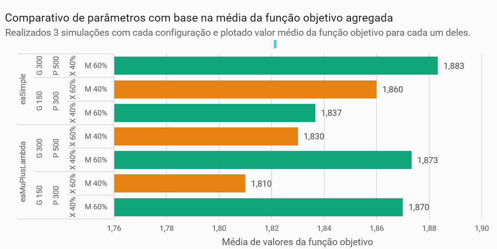
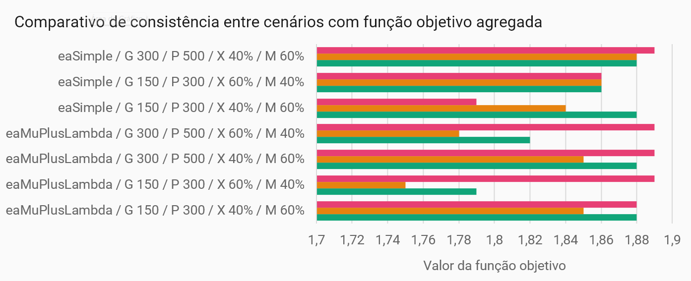
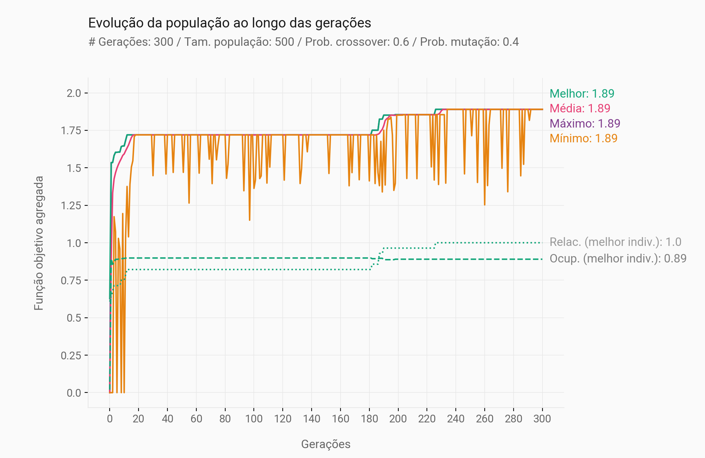
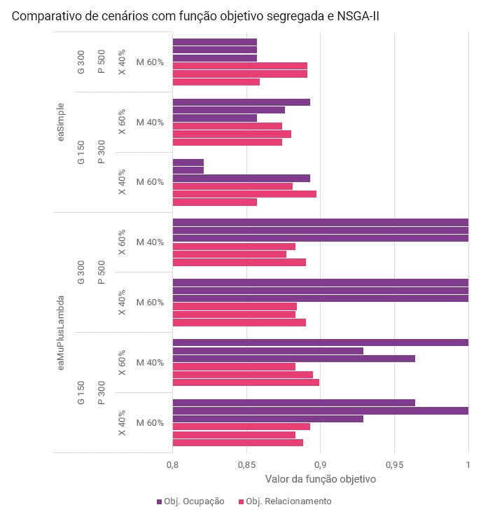
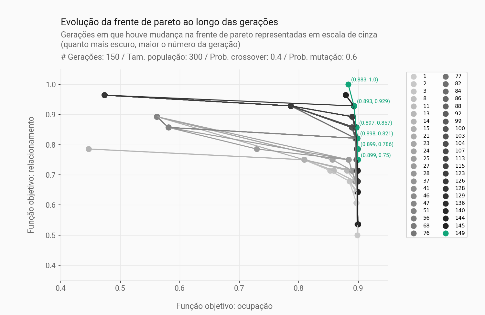

# Otimização da escala de funcionários em regime híbrido

#### Aluno: [Victor Moreira Araújo](https://github.com/victoraraujo01/)
#### Orientadora: Carolina Abreu

---

Trabalho apresentado ao curso [BI MASTER](https://ica.puc-rio.ai/bi-master) como pré-requisito para conclusão de curso e obtenção de crédito na disciplina "Projetos de Sistemas Inteligentes de Apoio à Decisão".

- [Link para o código](hybrid_work_distribution.ipynb).

---

### Resumo

Este projeto tem como objetivo apresentar o desenvolvimento de um modelo de otimização para a escala de funcionários em regime híbrido, buscando a maximização de dois objetivos: a manutenção do espaço físico ocupado ao longo de toda a semana e a alocação de setores com funções relacionadas nos mesmos dias de trabalho presencial.

Por se tratar de um problema de otimização com múltiplos objetivos, foram realizados experimentos com estratégias distintas: a primeira, utilizando uma função objetivo agregada — com o valor dos dois objetivos somados e ponderados — e seleção por torneio; e a segunda, utilizando uma função objetivo com uma tupla de valores e seleção NSGA-II (Non-dominated Sorting Genetic Algorithm). Além disso, também foi avaliado o efeito da variação do algoritmo evolutivo entre o `eaSimple` e o `mu_plus_lambda` da biblioteca `deap`, e dos parâmetros de crossover, mutação, número de gerações e tamanho da população.

Para os cenários com grandes populações e muitas gerações, os melhores resultados foram obtidos de maneira consistente utilizando o algoritmo `mu_plus_lambda` e a seleção NSGA-II, com percentuais de crossover ligeiramente inferiores aos de mutação. Contudo, para populações menores, a função objetivo agregada e a seleção por torneio retornou resultados melhores do que o NSGA-II, tanto com o algoritmo `eaSimple` quanto com o `mu_plus_lambda`.

Espera-se, com esse trabalho, entregar um produto que contribua para uma maior eficiência no uso do espaço físico, redução de custos operacionais e aumento da satisfação dos funcionários, promovendo um equilíbrio entre trabalho remoto e presencial de forma estratégica. Esse estudo contribui para a modernização dos modelos de trabalho e pode ser aplicado em diversas organizações que buscam melhorar sua gestão de equipes híbridas.

### 1. Introdução

O regime de trabalho híbrido surgiu no contexto pós-pandêmico como uma alternativa que busca unir o melhor do trabalho remoto (ou _home office_) com os benefícios do modelo convencional presencial. Como uma consequência da flexibilidade que o torna atrativo, o modelo híbrido pode ser estabelecido de diversas formas diferentes, pois há uma grande quantidade de arranjos possíveis para divisão da força de trabalho por dias da semana ou até do mês. 

Nesse sentido, esse trabalho se propõe a encontrar os melhores arranjos para distribuição de funcionários de uma empresa ao longo da semana, considerando as seguintes restrições parametrizáveis pelo usuário:

1. Capacidade física máxima do espaço;
2. Ocupação desejada diferente por dia da semana;
3. Quantidade de dias presenciais obrigatórios diferente por setor;
4. Fixação dos dias de trabalho presencial de determinados setores;
5. Exclusão de determinadas combinações de dias.

Para avaliar quão bons são os arranjos propostos pela ferramenta, foram considerados dois objetivos distintos: (i) a manutenção do espaço físico ocupado ao longo de toda a semana e (ii) a alocação de setores com funções relacionadas nos mesmos dias de trabalho presencial.

Em um cenário como o proposto, com múltiplos objetivos, problemas de otimização se tornam substancialmente mais complexos e o emprego de algoritmos genéticos surge como uma excelente alternativa para viabilizá-lo. Assim, foi utilizada a biblioteca `deap` (_Distributed Evolutionary Algorithms in Python_), uma biblioteca desenvolvida em Python para facilitar a criação, implementação e execução de algoritmos evolutivos, como algoritmos genéticos e estratégias evolutivas, de forma flexível e eficiente.

A primeira parte do desenvolvimento de um trabalho como este, com algoritmos genéticos, envolve a modelagem do problema utilizando os conceitos de algoritmo genético. Assim, será apresentada a lógica para representação do problema em **indivíduos**, que correspondem a uma solução potencial para o problema que se deseja otimizar e **população**, conjunto de todos os indivíduos em uma **geração**.

Com esses conceitos definidos, o próximo passo é a construção da **função objetivo**, responsável por quantificar o(s) objetivo(s) do problema, e da **função de restrição**, que determina se um indivíduo está apto, ou não, para ser considerado como uma possível solução do problema.

Concluindo a modelagem, definem-se os operadores de **_crossover_** (operador genético que combina duas soluções － pais － para gerar uma nova solução － filho); e **mutação** (operador que faz pequenas alterações em um indivíduo para introduzir diversidade genética).

Com a modelagem definida, foi possível avaliar o impacto de diversos parâmetros e estratégias do algoritmo genético na qualidade da solução. Serão apresentados resultados da otimização utilizando métodos de seleção diferentes, estratégias alternativas para a função objetivo, algoritmos evolutivos distintos e o impacto das mudanças nos parâmetros de crossover, mutação, população e números de gerações.

### 2. Modelagem

#### 2.1. Arquivos de entrada

O projeto depende de dois arquivos .csv de input

- `pessoas_por_gerencia.csv`: esse arquivo deve possuir os IDs de cada setor, a sua quantidade de pessoas e a quantidade de dias obrigatórios.
- `relacionamentos.csv`: esse arquivo deve possuir, para cada setor, a lista de IDs dos setores relacionados, ou seja, aqueles que preferencialmente devem estar nos mesmos dias de presencial.

#### 2.2. Inputs do usuário (restrições do problema)

- `CAPACIDADE_PREDIO`: Constante que determina a capacidade máxima de pessoas. Exemplo: `300` pessoas;
- `QTD_DIAS_PRESENCIAIS_POSSIVEIS`: Lista de inteiros que representam com a quantidade de dias da semana possíveis. Exemplo: `[2, 3]` indica que são possíveis combinações de 2 e 3 dias de presencial;
- `COMBINACOES_DIAS_PROIBIDAS`: Lista de combinações de dias proibidas. Cada combinação é uma lista de 5 booleanos representados por 0 ou 1, indicando se o dia da semana correspondente àquela posição é de presencial (1) ou não (0). Exemplo: o valor `[[1,0,0,1,1], [0,1,1,1,0]]` indica que estão proibidas as combinações de trabalho presencial na segunda, quinta e sexta e na terça, quinta e sexta.
- `OCUPACAO_DESEJADA_POR_DIA`: Ocupação desejada por dia, caso haja interesse de manter o prédio mais livre em alguns dias da seman (representada por um valor percentual de 0 a 1 aplicado ao dia da semana correspondente àquela posição). Exemplo: a entrada `[0.9, 0.9, 0.95, 0.9, 0.9]` mostra um interesse de maior ocupação na quarta-feira.
- `GERENCIAS_FIXAS`: Dicionário que indica quais setores que têm dias fixos. Cada chave é o índice do setor e o valor é uma lista de 5 booleanos representados por 0 ou 1, indicando se o dia da semana correspondente àquela posição é de presencial, ou não. Exemplo: o dicionário `{8: [1,1,1,0,0], 12: [1,0,0,1,1]}` indica que o setor 8 obrigatoriamente deve trabalhar presencialmente na segunda, terça e quarta e o setor 12, na segunda, quinta e sexta.
- `PESO_OCUPACAO` e `PESO_RELACIONAMENTOS`: valores inteiros de 0 a 1 utilizados como pesos na função objetivo agregada, para dar mais relevância a um dos objetivos.

#### 2.3. Indivíduo

O indivíduo para esse problema é representado por uma matriz com N linhas e 5 colunas, sendo N a quantidade de setores indicados no arquivo `pessoas_por_gerencia.csv`, por exemplo:

| ID | Setor | Segunda | Terça | Quarta | Quinta | Sexta |
|----|-------|---------|-------|--------|--------|-------|
| 0  | A     |    4    |   4   |    4   |    0   |   0   |
| 1  | B     |    0    |   0   |   17   |   17   |   17  |
| 2  | C     |    1    |   0   |    0   |    1   |   0   |
| 3  | D     |    0    |   61  |    0   |   61   |   61  |
| 4  | E     |    0    |   0   |    0   |   13   |   13  |
| 5  | F     |    3    |   3   |    3   |    0   |   0   |
| 6  | G     |    52   |   52  |   52   |    0   |   0   |
| 7  | H     |    8    |   8   |    0   |    0   |   0   |
| 8  | I     |    0    |   0   |   72   |   72   |   72  |
| 9  | J     |    0    |   0   |    0   |   18   |   18  |
| 10 | K     |    35   |   35  |   35   |    0   |   0   |

Cada linha da matriz representa um setor e cada coluna, um dia da semana. O valor de cada célula da matriz corresponde, portanto, à quantidade de pessoas do setor trabalhando presencialmente naquele dia da semana.

Visando simplificar o problema, ao invés de realizar a seleção aleatória de cada um dos Nx5 valores durante a criação do indivíduo, decidiu-se selecionar aleatoriamente **_a combinação de dias de cada setor_** entre as combinações permitidas e preencher a matriz a partir daí. Assim como mostrado na seção [2.2](#22-inputs-do-usuário-restrições-do-problema) a combinação é uma lista de 5 booleanos representados por 0 ou 1, indicando se o dia da semana correspondente àquela posição é de presencial (1) ou não (0). A partir daí, a combinação de cada setor é multiplicada pela sua respectiva quantidade de pessoas para deixar o indivíduo em seu formato final.

Essa abordagem reduz significativamente a quantidade de indivíduos inválidos possíveis de serem gerados, diminuindo também a quantidade de restrições que precisam ser impostas no modelo e acelera a convergência. Antes de realizar a implementação em Python e `deap` foram feitas tentativas com o Solver que esbarraram em dificuldades oriundas justamente dessas condições.

#### 2.4. Função de restrição e objetivo

Em função da simplificação empregada na geração do indivíduo, a única restrição que precisou ser implementada foi a obrigação de respeitar a ocupação máxima desejada de cada andar por dia, considerando os fatores informados pelo usuário na variável `OCUPACAO_DESEJADA_POR_DIA`.

Já a função objetivo avalia dois critérios de otimização, conforme citado na [introdução](#1-introdução):

1. Manter o prédio com ocupação o mais constante possível ao longo da semana, considerando a possível variação de ocupação desejada por dia informada em `OCUPACAO_DESEJADA_POR_DIA`;
2. Maior quantidade possível de setores relacionados (conforme indicado no arquivo `relacionamentos.csv`) trabalhando nos mesmos dias de presencial;

Por se tratar de um problema de otimização com múltiplos objetivos, foram criadas duas funções objetivos: a `funcao_objetivo` e a `funcao_objetivo_agregada`, buscando avaliar a resposta do `deap` para uma otimização utilizando uma estratégia que considere os dois objetivos separadamente e outra, mais simples, que utiliza apenas a soma dos dois objetivos.

Assim, cada objetivo foi modelado como um fator que varia entre zero e um: `fitness_ocupacao` e `fitness_relacionamentos`. Caso o usuário tenha interesse em dar um peso maior para algum desses fatores na funcao objetivo agregada, ele pode fazê-lo alterando as variáveis `PESO_OCUPACAO` e `PESO_RELACIONAMENTOS`, como explicado na seção [2.2](#22-inputs-do-usuário-restrições-do-problema).

O fator `fitness_ocupacao` foi calculado usando a fórmula f(v)=exp(−v^k/s^k), em que `v` é a variância e `s` e `k` são constantes para ajustar quão rápido o valor converge para zero. Essa fórmula foi uma sugestão obtida no [Stack Exchange](https://math.stackexchange.com/questions/2833062/a-measure-similar-to-variance-thats-always-between-0-and-1) como uma alternativa de medida de dispersão sempre com valor entre 0 e 1, a fim de mantê-la num _range_ compatível com o outro objetivo.

O fator `fitness_relacionamentos` foi calculado dividindo a _quantidade de relacionamentos respeitados_ pela _quantidade total de relacionamentos informados_. Para que um relacionamento seja respeitado, todos os colaboradores dos dois setores precisam estar presentes nos mesmos dias. Caso os dois setores tenham quantidades diferentes de dias presenciais exigidos, vale o menor para essa avaliação.

#### 2.5. Mutação e crossover

Em alguns casos, conforme probabilidade de mutação informado na configuração do algoritmo (`MUTPB`), o indivíduo sofrerá uma mutação, com a variação de algum dos seus cromossomos (linhas da matriz, como explicado em [2.3](#23-indivíduo)). Nesse caso, um ou mais setores terão a sua combinação de dias selecionada alterada.

No algoritmo implementado nesse trabalho, existe uma probabilidade específica de cada linha (cromossomo) ser alterada (`indpb`), caso em que uma nova combinação de dias é sorteada. Importante atentar que, em função da restrição imposta pelo próprio problema, os setores com dias fixos não podem sofrer mutação.

Para a função de crossover, foi necessário fazer uma modificação no método padrão do `deap` pois como cada linha (cromossomo) tem a quantidade de empregados de cada setor trabalhando presencialmente por dia (coluna), não é possível simplesmente trocar as linhas de posição. Isso porque, ao fazer qualquer inversão dessa forma, estaríamos levando a quantidade de colaboradores de um setor para outra, alterando as características do problema informadas pelo usuário.

Nesse cenário, a solução proposta foi obter a combinação de dias original de cada indivíduo e realizar o two-point crossover deste objeto, respeitando, também, a restrição dos setores com dias fixados pelo usuário.

### 3. Resultados

Como explicado no [Resumo](#resumo) e na [Introdução](#1-introdução), foram avaliadas duas estratégias principais de otimização: a primeira, utilizando uma função objetivo agregada — com o valor dos dois objetivos somados e ponderados — e seleção por torneio; e a segunda, utilizando uma função objetivo com uma tupla de valores e seleção NSGA-II (Non-dominated Sorting Genetic Algorithm).

Para tanto, em cada uma dessas estratégias foi avaliado o impacto no resultado da função objetivo ao realizar alterações no algoritmo, quantidade de gerações, tamanho da população, percentual de cruzamento (_crossover_) e percentual de mutações.

Utilizou-se como entrada os arquivos `pessoas_por_gerencia.csv` e `relacionamentos.csv` disponibilizados no repositório, retratando um cenário hipotético com 24 setores com 498 funcionários e um edifício com 290 postos de trabalho. 

#### 3.1. Otimização com função objetivo agregada

A primeira estratégia avaliada foi a de otimização com um único objetivo, utilizando a `funcao_objetivo_agregada`, conforme detalhado na seção [2.4](#24-função-de-restrição-e-objetivo). O algoritmo foi executado três vezes para cada cenário avaliado, e o gráfico abaixo mostra, para cada um deles, a média dos valores da função objetivo. 

As barras destacadas em verde correspondem aos cenários com maior percentual de mutação, enquanto as barras laranjas representam os casos com maior precentual de cruzamento.

Já o gráfico abaixo, mostra o resultado para cada uma das execuções do algoritmo de otimização, para avaliarmos a consisência.

A partir dos gráficos apresentados, podemos inferir que o **aumento da população e número de gerações teve um impacto positivo**, melhorando em todos os casos o resultado obtido. É possível atribuir esse efeito em maior peso ao aumento da população, pois, **apenas em um caso a convergência ocorreu após a geração 150**, mostrado na figura abaixo.

Com populações menores, **o uso do algoritmo `eaMuPlusLambda` pareceu conseguiu gerar resultados melhores de maneira mais consistente, especialmente no cenário com maior percentual de mutação**. O algoritmo `eaSimple` mostrou o comportamento oposto com populações menores: os melhores resultados foram apresentados no cenário com menor percentual de mutação e maior probabilidade de cruzamentos.

Além disso, entre os cenários com 300 gerações e população de 500 indivíduos, **o `eaSimple` retornou o melhor resultado obtido, com média de 1,883, e chegando no valor de 1,89**. Esse é o máximo encontrado em todos os cenários avaliados (inclusive com outras estratégias).

#### 3.2. Otimização com função objetivo segregada e NSGA-II

A segunda estratégia avaliada foi a de otimização com múltiplos objetivos, utilizando a `funcao_objetivo`, conforme detalhado na seção [2.4](#24-função-de-restrição-e-objetivo). O algoritmo foi executado três vezes para cada cenário avaliado, e o gráfico abaixo mostra, para cada um deles, o valor de cada um dos objetivos (atendimento aos relacionamentos e à ocupação). 

Observa-se de imediato que **o algoritmo `eaSimple` não conseguiu entregar bons resultados na otimização com múltiplos objetivos** e que o aumento da população e da quantidade de gerações não surtiu efeito. Mesmo com taxas maiores de mutação, não foi possível gerar indivíduos válidos que atendessem a todos os relacionamentos (_obj. relacionamentos = 1_), fato que foi observado com esse mesmo algoritmo quando utilizada a função objetivo agregada.

Já **o algoritmo `eaMuPlusLambda` mostrou resultados bem melhores e foi positivamente impactado pelo aumento das gerações e população**. Nesse caso, o aumento da quantidade de gerações parece também ter sido importante, pois em todas as execuções com 150 gerações e população de 300 indivíduos houve alterações na frente de pareto após a centésima geração. Nos casos com maior percentual de mutação as mudanças ocorreram mais próximo ainda do término, sempre após a geração 140, conforme gráfico abaixo.

Com **a população de 500 indivíduos e a otimização em 300 gerações, todas as execuções com o `eaMuPlusLambda` apresentaram indivíduos válidos que atendessem a todos os relacionamentos (_obj. relacionamentos = 1_) na frente de pareto e chegaram a atingir o valor máximo de 1,89**. 

**A diferença entre os cenários com percentual de mutação e crossover diferentes não foi significativa**, sendo menor do que 1%, na média.

Uma vantagem da estratégia de otimização com múltiplos objetivos utilizando a função objetivo segregada é a interpretação dos melhores resultados através da frente de pareto. **Esse mecanismo permite avaliar os melhores indivíduos priorizando independentemente cada um dos objetivos e, assim, ter uma visão mais ampla das soluções possíveis**. 

No contexto específico desse problema, o objetivo da ocupação era mais facilmente atendido e não seria tão crítico desde que o limite de postos de trabalho não fosse ultrapassado (condição mapeada na função de restrição). Assim, a análise acabou se resumindo a quais indivíduos atendiam mais relacionamentos entre os setores. Contudo, num problema diferente em que os objetivos sejam conflitantes entre si, a análise da frente de pareto traz maior clareza do que se ganha ou perde com cada solução.

Abaixo está mostrado o **melhor indivíduo encontrado em todos os cenários**, com o algoritmo `muPlusLambda`, NSGA-II, 300 gerações, população de 500 indivíduos, 40% de crossover e 60% de mutação.

| Setor    | Segunda | Terça   | Quarta  | Quinta  | Sexta   |
|----------|---------|---------|---------|---------|---------|
| A        | 4       | 4       | 4       | 0       | 0       |
| B        | 0       | 0       | 0       | 0       | 0       |
| C        | 17      | 0       | 17      | 17      | 0       |
| D        | 1       | 0       | 0       | 1       | 0       |
| E        | 0       | 61      | 0       | 61      | 61      |
| F        | 0       | 0       | 0       | 13      | 13      |
| G        | 3       | 3       | 3       | 0       | 0       |
| H        | 0       | 0       | 0       | 0       | 0       |
| I        | 52      | 52      | 52      | 0       | 0       |
| J        | 8       | 8       | 0       | 0       | 0       |
| K        | 0       | 0       | 72      | 72      | 72      |
| L        | 0       | 0       | 0       | 18      | 18      |
| M        | 35      | 35      | 35      | 0       | 0       |
| N        | 24      | 24      | 0       | 0       | 0       |
| O        | 0       | 0       | 0       | 0       | 0       |
| P        | 4       | 4       | 0       | 0       | 0       |
| Q        | 29      | 29      | 29      | 0       | 0       |
| R        | 7       | 7       | 0       | 0       | 0       |
| S        | 0       | 0       | 48      | 48      | 48      |
| T        | 0       | 0       | 0       | 13      | 13      |
| U        | 11      | 11      | 0       | 11      | 0       |
| V        | 1       | 0       | 0       | 1       | 0       |
| W        | 13      | 13      | 13      | 0       | 0       |
| X        | 4       | 4       | 0       | 0       | 0       |
| **Total**| **213** | **255** | **273** | **255** | **225** |

### 4. Conclusões

Ao longo do desenvolvimento desse trabalho foram analisadas várias estratégias possíveis para a solução de um problema de otimização com múltiplos objetivos utilizando algoritmos genéticos implementados com a biblioteca `deap` em Python.

No contexto específico deste problema, o melhor resultado foi obtido utilizando o algoritmo `muPlusLambda`, com a seleção por NSGA-II, 300 gerações, população de 500 indivíduos, 40% de crossover e 60% de mutação. Em particular, o uso do algoritmo `muPlusLambda` viabilizou a utilização do NSGA-II, que não chegava a entregar bons resultados com o `eaSimple`. Em todas as 6 execuções feitas com `muPlusLambda` e NSGA-II foi possível chegar no ótimo global para o objetivo de atendimento aos relacionamentos, mesmo com diferentes percentuais de mutação e crossover.

Todavia, uma abordagem mais simples, utilizando uma função objetivo agregada (somando as parcelas do objetivo de atendimento aos relacionamentos e ao critério da ocupação), seleção por torneio e o algoritmo `muPlusLambda`, se mostrou muito eficaz no cenário com menor população e quantidade de gerações, podendo ser uma alternativa viável em um contexto com limitação de recursos computacionais.

Visando ampliar o escopo do problema analizado, sugere-se explorar também em trabalhos futuros o tema de otimização da distribuição de colaboradores no espaço físico, buscando posicionar os setores relacionados fisicamente mais próximos e tentando mantê-los sempre ocupando as mesmas posições ao longo da semana.

---

Matrícula: 221.101.037

Pontifícia Universidade Católica do Rio de Janeiro

Curso de Pós Graduação *Business Intelligence Master*
